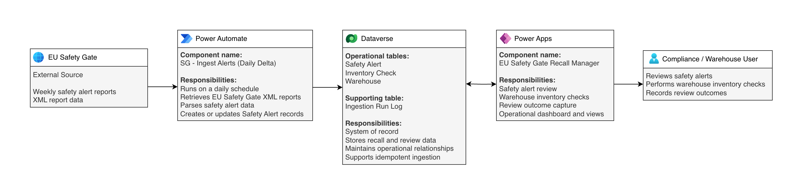

# EU Safety Gate Recall Manager

A Microsoft Power Platform solution that ingests EU Safety Gate product-safety alert data into Microsoft Dataverse and supports structured warehouse inventory reviews through a model-driven Power App.

## Architecture

The solution uses a scheduled Power Automate flow to retrieve and parse EU Safety Gate XML report data, Microsoft Dataverse as the system of record, and a model-driven Power App for compliance and warehouse review.

See [Architecture](docs/architecture.md) for implementation details.

## Solution

- **SG - Ingest Alerts (Daily Delta)** runs on a daily schedule and retrieves EU Safety Gate XML report data.
- Imported alerts are parsed and written to the Dataverse **Safety Alert** table.
- Existing Safety Alert records are updated while new alerts are created to avoid duplicate ingestion.
- **Inventory Check** and **Warehouse** records support the manual warehouse review process.
- The **EU Safety Gate Recall Manager** model-driven app provides alert review, inventory-check forms, views, and an operational dashboard.
- Compliance and warehouse users remain responsible for recording review outcomes.

## Technologies

- Power Apps (Model-driven App)
- Power Automate (Cloud Flow)
- Microsoft Dataverse
- HTTP-based XML retrieval
